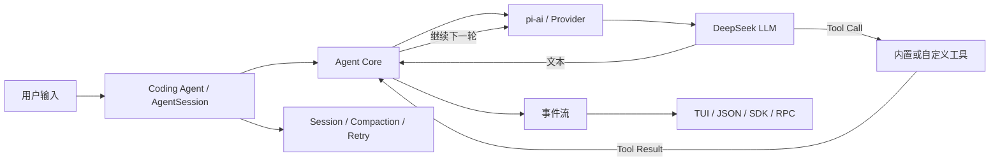

# Pi Agent Framework 学习路线（0 → 1）

> 适用仓库：`/Users/leon/Documents/PI/pi`
> 当前基准源码版本：`0.84.4`
> 制定日期：2026-08-10
> 建议节奏：6 周，每天 1～2 小时
> 学习目标：从“会使用 Pi”成长到“能独立开发、测试和解释一个基于 Pi 的 Agent”

## 1. 最终目标

完成这条路线后，应当能够独立完成以下工作：

- 解释一次 Agent 请求从用户输入到最终回答的完整链路。
- 理解模型消息、Agent 消息、Tool Call、Tool Result 和事件流之间的关系。
- 使用 `pi-ai` 调用 DeepSeek，并处理流式事件和工具调用。
- 使用 `pi-agent-core` 组装带状态、工具、事件和中断能力的 Agent。
- 编写 Pi Extension，自定义工具、命令、生命周期钩子和权限检查。
- 使用 Coding Agent SDK 构建一个独立应用，而不依赖交互式 CLI。
- 理解 Session、分支、压缩、重试、Steering 和 Follow-up。
- 为 Agent 编写确定性测试，并明确权限、安全和可观测性边界。
- 独立完成一个“只读代码仓库分析 Agent”作为毕业项目。

## 2. 当前起点

第一阶段的环境准备已经完成：

- [x] 克隆仓库到 `/Users/leon/Documents/PI/pi`。
- [x] 安装依赖：`npm ci --ignore-scripts`。
- [x] 补全源码运行需要的模型目录。
- [x] 在初始基线 `0.84.1` 上完成源码版 Pi 和 DeepSeek 真实请求验证。
- [x] 将本地 `main` 快进到原始仓库 `upstream/main` 的 `0.84.4` 基线，并从该基线创建 `diy`。
- [x] 验证 `deepseek-v4-flash` 可以被源码版 Pi 识别。
- [x] 使用只读工具完成一次真实 DeepSeek 请求，退出码为 0。
- [x] 确认 Git 工作区没有产生跟踪文件改动。

已知环境说明：

- 当前 Node.js 为 `22.23.1`，满足 Pi 主仓库要求的 `>=22.19.0`。
- Gondolin 示例要求 Node.js `>=23.6.0`，本路线前期不学习或运行 Gondolin。
- DeepSeek 密钥通过环境变量 `DEEPSEEK_API_KEY` 提供，不应写入代码、笔记或 Git。
- 本路线不执行 Claude 相关配置、登录、模型调用或扩展。

## 3. 先建立框架全景图

Pi 是一个“小核心、强扩展”的 TypeScript Agent Harness，不是单一的聊天 CLI。



### 3.1 核心包

| 包 | 主要职责 | 学习优先级 |
| --- | --- | --- |
| `packages/ai` | 模型、Provider、消息、流式响应、Tool Schema | 高 |
| `packages/agent` | Agent 循环、状态、事件、工具执行 | 最高 |
| `packages/coding-agent` | Session、内置工具、扩展、SDK、CLI | 最高 |
| `packages/tui` | 终端差分渲染和交互组件 | 后期 |
| `packages/telemetry` | 厂商中立的遥测契约 | 中后期 |
| `packages/protocol` | 远程会话的 CBOR 协议 | 高级阶段 |
| `packages/client` | 远程 Pi Session 客户端 | 高级阶段 |
| `packages/server` | 实验性远程服务端 | 高级阶段 |
| `packages/session-backends/sqlite-node` | SQLite Session 后端 | 中后期 |
| `packages/evals` | Agent 评估和测试 Harness | 中后期 |

### 3.2 最重要的源码调用链

阅读源码时，始终围绕下面这条链路，不要一开始陷入所有文件：

```text
CLI main()
  → createAgentSessionRuntime()
  → AgentSession.prompt()
  → Agent.prompt()
  → agentLoop()
  → streamAssistantResponse()
  → Provider / LLM
  → executeToolCalls()
  → Tool Result
  → 下一轮 LLM 或 agent_end
```

对应源码入口：

- [`packages/coding-agent/src/main.ts`](../packages/coding-agent/src/main.ts)
- [`packages/coding-agent/src/core/agent-session-runtime.ts`](../packages/coding-agent/src/core/agent-session-runtime.ts)
- [`packages/coding-agent/src/core/agent-session.ts`](../packages/coding-agent/src/core/agent-session.ts)
- [`packages/agent/src/agent.ts`](../packages/agent/src/agent.ts)
- [`packages/agent/src/agent-loop.ts`](../packages/agent/src/agent-loop.ts)

## 4. 学习方法

每个阶段都遵循同一个闭环：

1. 先运行并观察行为。
2. 再阅读最小必要文档。
3. 沿真实调用链阅读源码。
4. 只修改一个变量完成实验。
5. 保存运行证据和学习笔记。
6. 通过验收标准后再进入下一阶段。

建议每次学习按下面的时间分配：

- 15 分钟：复习上次结论，确定今天唯一目标。
- 30 分钟：阅读文档或源码。
- 45 分钟：完成一个最小实验。
- 15 分钟：整理事件、错误和结论。
- 15 分钟：用自己的话解释今天学到的机制。

不要只阅读源码。每个概念都至少需要一次可运行实验和一条可验证证据。

## 5. 总体进度

| 阶段 | 主题 | 建议时间 | 状态 |
| --- | --- | ---: | --- |
| 0 | 环境和真实请求验证 | 0.5 天 | 已完成 |
| 1 | CLI、运行模式和事件流 | 2 天 | 待开始 |
| 2 | `pi-ai` 模型抽象与 Tool Call | 3 天 | 待开始 |
| 3 | `pi-agent-core` Agent 循环 | 4 天 | 待开始 |
| 4 | Coding Agent Extension | 1 周 | 待开始 |
| 5 | SDK、Session 和上下文管理 | 1 周 | 待开始 |
| 6 | 安全、测试、重试和可观测性 | 1 周 | 待开始 |
| 7 | 毕业项目：只读仓库分析 Agent | 1～2 周 | 待开始 |
| 8 | RPC、远程 Session、TUI 和生态 | 按需 | 可选 |

---

## 6. 阶段 1：CLI、运行模式和事件流

### 目标

不修改框架源码，先从外部观察 Pi 的输入、消息、工具和事件。

### 必读材料

按顺序阅读：

1. [`packages/coding-agent/docs/quickstart.md`](../packages/coding-agent/docs/quickstart.md)
2. [`packages/coding-agent/README.md`](../packages/coding-agent/README.md) 中的 CLI Reference
3. [`packages/coding-agent/docs/json.md`](../packages/coding-agent/docs/json.md)
4. [`packages/agent/README.md`](../packages/agent/README.md) 中的 Event Flow

### 实验 1：对比三种运行模式

```bash
cd /Users/leon/Documents/PI/pi

# 交互模式
./pi-test.sh \
  --provider deepseek \
  --model deepseek-v4-flash \
  --tools read,grep,find,ls \
  --no-session

# Print 模式
./pi-test.sh \
  --provider deepseek \
  --model deepseek-v4-flash \
  --tools read,grep,find,ls \
  --no-session \
  -p "只读说明 packages/agent 的职责"

# JSON 事件模式
mkdir -p learning/artifacts/stage-1
./pi-test.sh \
  --provider deepseek \
  --model deepseek-v4-flash \
  --tools read \
  --no-session \
  --no-extensions \
  --no-skills \
  --no-prompt-templates \
  --no-themes \
  --no-context-files \
  --mode json \
  "读取 package.json，并告诉我 Node.js 版本要求" \
  > learning/artifacts/stage-1/events.jsonl
```

### 实验 2：提取事件顺序

```bash
jq -r '.type' learning/artifacts/stage-1/events.jsonl
```

把结果整理成类似下面的链路：

```text
session
→ agent_start
→ turn_start
→ message_start
→ message_update...
→ tool_execution_start
→ tool_execution_end
→ message_end
→ turn_end
→ agent_end
```

### 必须回答的问题

- Interactive、Print、JSON 和 RPC 模式分别解决什么问题？
- `message_update` 为什么只保存增量，而不是每次保存完整消息？
- 一次 Turn 和一次完整 Agent Run 有什么区别？
- 为什么执行工具后通常还需要再次请求模型？
- `tool_execution_end` 和 `toolResult` 消息是不是同一个东西？

### 产出物

- `learning/artifacts/stage-1/events.jsonl`
- `learning/notes/stage-1-event-flow.md`
- 一张自己绘制的 Agent 事件时序图

### 验收标准

- [ ] 能从 JSONL 中找到一次真实 Tool Call 的开始和结束事件。
- [ ] 能解释 `agent_start → turn_start → tool call → turn_end → agent_end`。
- [ ] 能说明四种运行模式的使用场景。
- [ ] 全程没有开放 `bash/edit/write` 工具。

---

## 7. 阶段 2：`pi-ai` 模型抽象与 Tool Call

### 目标

理解 Pi 如何把不同模型供应商统一成相同的消息、流式事件和工具接口。

### 必读材料

1. [`packages/ai/README.md`](../packages/ai/README.md) 的 Quick Start
2. 同一文档的 Providers and Models
3. 同一文档的 Tools、Thinking、Stop Reasons 和 Error Handling
4. [`packages/ai/src/types.ts`](../packages/ai/src/types.ts)
5. [`packages/ai/src/models.ts`](../packages/ai/src/models.ts)
6. [`packages/ai/src/providers/deepseek.ts`](../packages/ai/src/providers/deepseek.ts)
7. [`packages/ai/src/api/openai-completions.ts`](../packages/ai/src/api/openai-completions.ts)

### 需要掌握的对象

- `Provider`
- `Model`
- `Context`
- `UserMessage`
- `AssistantMessage`
- `ToolResultMessage`
- `Tool`
- `EventStream`
- `stopReason`

### 实验 1：最小流式调用

创建：

```text
learning/labs/02-pi-ai-stream.ts
```

实现以下行为：

1. 只注册 `deepseekProvider()`。
2. 获取 `deepseek-v4-flash`。
3. 构造一个只包含 system prompt 和 user message 的 `Context`。
4. 使用 `models.stream()` 调用模型。
5. 分别打印 `text_delta`、`thinking_delta`、`done` 和 `error`。
6. 最后调用 `response.result()` 获得权威的最终消息。

运行方式：

```bash
npx tsx learning/labs/02-pi-ai-stream.ts
```

### 实验 2：手动完成一次 Tool Call 闭环

增加一个无副作用工具，例如：

```text
get_current_time(timezone?)
```

手动实现：

```text
模型返回 Tool Call
→ 校验参数
→ 本地执行工具
→ 构造 ToolResultMessage
→ 追加到 Context
→ 再次调用模型
→ 获得最终自然语言回答
```

### 必须回答的问题

- Provider 和 Model 为什么是两个对象？
- `stream()` 与 `complete()` 的差别是什么？
- 为什么工具参数要使用 TypeBox Schema？
- Tool Result 为什么必须带上 `toolCallId` 和 `toolName`？
- `stopReason` 为 `error`、`aborted`、`length` 时分别应该怎么处理？

### 产出物

- `learning/labs/02-pi-ai-stream.ts`
- `learning/labs/02-pi-ai-tool-loop.ts`
- `learning/notes/stage-2-pi-ai.md`

### 验收标准

- [ ] 能独立完成一次 DeepSeek 流式调用。
- [ ] 能正确组装 Context 和三类核心消息。
- [ ] 能手动完成一次 Tool Call → Tool Result → 最终回答。
- [ ] 能解释为什么 `pi-ai` 还不是完整的 Agent。

---

## 8. 阶段 3：`pi-agent-core` Agent 循环

### 目标

从手写 Tool Call 循环升级到使用 Pi 的 Agent Runtime。

### 必读材料

1. [`packages/agent/README.md`](../packages/agent/README.md)
2. [`packages/agent/src/types.ts`](../packages/agent/src/types.ts)
3. [`packages/agent/src/agent.ts`](../packages/agent/src/agent.ts)
4. [`packages/agent/src/agent-loop.ts`](../packages/agent/src/agent-loop.ts)
5. [`packages/agent/test/agent-loop.test.ts`](../packages/agent/test/agent-loop.test.ts)
6. [`packages/agent/test/agent.test.ts`](../packages/agent/test/agent.test.ts)

### 源码阅读顺序

1. 从 `Agent.prompt()` 开始。
2. 找到 `runPromptMessages()`。
3. 找到 `agentLoop()` 和 `runLoop()`。
4. 找到 `streamAssistantResponse()`。
5. 找到 `executeToolCalls()`。
6. 对比串行和并行工具执行。
7. 回到 `Agent.processEvents()`，观察状态如何更新。

### 实验 1：使用 Agent 类替换手写循环

创建：

```text
learning/labs/03-agent-core.ts
```

要求：

- 使用 DeepSeek 模型。
- 注册一个无副作用工具。
- 订阅全部事件并输出事件名称。
- 调用 `agent.prompt()`。
- 等待 `agent_end`。
- 输出最终 `agent.state.messages`。

### 实验 2：观察工具执行策略

创建两个模拟慢工具：

- `slow_a`：等待约 300ms。
- `slow_b`：等待约 500ms。

分别使用：

- `toolExecution: "parallel"`
- `toolExecution: "sequential"`

记录总耗时和事件顺序，说明“完成顺序”和“写入消息顺序”为何可能不同。

### 实验 3：控制 Agent

依次练习：

- `AbortSignal`
- `agent.abort()`
- `agent.steer()`
- `agent.followUp()`
- `beforeToolCall`
- `afterToolCall`
- `shouldStopAfterTurn`

### 必须回答的问题

- `AgentMessage` 和 LLM `Message` 为什么需要分开？
- `transformContext()` 和 `convertToLlm()` 分别在哪个阶段执行？
- Agent 的外层循环和内层循环分别处理什么？
- Steering 和 Follow-up 的注入时机有什么区别？
- 为什么工具失败应该抛异常，而不是把错误伪装成成功文本？

### 产出物

- `learning/labs/03-agent-core.ts`
- `learning/labs/03-parallel-tools.ts`
- `learning/notes/stage-3-agent-loop.md`
- 一张从 `Agent.prompt()` 到 `agent_end` 的源码调用图

### 验收标准

- [ ] 能不看文档解释 `agentLoop()` 的核心循环。
- [ ] 能实现并解释一个带工具的 Agent。
- [ ] 能说明并行工具的事件顺序和消息顺序。
- [ ] 能正确处理中断、工具错误和 Agent 收尾。

---

## 9. 阶段 4：Coding Agent Extension

### 目标

在不修改 Pi 核心源码的情况下扩展 Agent 行为。

### 必读材料

1. [`packages/coding-agent/docs/extensions.md`](../packages/coding-agent/docs/extensions.md)
2. [`packages/coding-agent/examples/extensions/README.md`](../packages/coding-agent/examples/extensions/README.md)
3. [`packages/coding-agent/examples/extensions/hello.ts`](../packages/coding-agent/examples/extensions/hello.ts)
4. [`packages/coding-agent/examples/extensions/permission-gate.ts`](../packages/coding-agent/examples/extensions/permission-gate.ts)
5. [`packages/coding-agent/examples/extensions/todo.ts`](../packages/coding-agent/examples/extensions/todo.ts)
6. [`packages/coding-agent/src/core/extensions/types.ts`](../packages/coding-agent/src/core/extensions/types.ts)
7. [`packages/coding-agent/src/core/extensions/runner.ts`](../packages/coding-agent/src/core/extensions/runner.ts)

### 按顺序完成五个 Extension

#### 4.1 Hello Tool

学习内容：

- `defineTool()`
- TypeBox 参数 Schema
- `pi.registerTool()`
- Tool Result 的 `content` 和 `details`

#### 4.2 Tool Logger

监听：

- `tool_execution_start`
- `tool_execution_update`
- `tool_execution_end`

记录工具名称、开始时间、结束时间、耗时和错误状态，不记录密钥或完整敏感参数。

#### 4.3 Permission Gate

要求：

- 在 `tool_call` 阶段拦截高风险命令。
- 有 UI 时请求确认。
- 无 UI 时默认拒绝。
- 用模拟字符串验证规则，不实际执行破坏性命令。

#### 4.4 Todo Tool

学习内容：

- 自定义工具状态。
- 把状态写入 Tool Result `details`。
- 从当前 Session Branch 恢复状态。
- Session 分支切换后的状态一致性。

#### 4.5 Context Injector

学习内容：

- `input`
- `before_agent_start`
- `context`
- `systemPromptAppend`
- 项目级上下文与用户输入的边界

### 推荐目录

```text
learning/labs/extensions/
├── hello.ts
├── tool-logger.ts
├── permission-gate.ts
├── todo.ts
└── context-injector.ts
```

加载单个 Extension：

```bash
./pi-test.sh \
  --provider deepseek \
  --model deepseek-v4-flash \
  --no-extensions \
  --extension ./learning/labs/extensions/hello.ts \
  --tools read,hello \
  --no-session
```

### 必须回答的问题

- Extension 与直接修改核心源码相比有什么优势？
- Event Hook 和 Custom Tool 的职责边界是什么？
- Extension 的内存状态为什么不能直接视为 Session 状态？
- 为什么恢复状态时只应该读取当前 Branch？
- TUI 模式和非交互模式下，权限确认策略为什么不同？

### 产出物

- 五个可以单独加载的 Extension。
- `learning/notes/stage-4-extensions.md`
- 每个 Extension 至少一组成功场景和失败场景。

### 验收标准

- [ ] 能注册自定义工具和命令。
- [ ] 能监听并解释 Extension 生命周期事件。
- [ ] Permission Gate 在无 UI 时默认拒绝高风险输入。
- [ ] Todo 状态在 Session 恢复和 Branch 切换后正确。
- [ ] Extension 之间没有共享不可控的全局状态。

---

## 10. 阶段 5：SDK、Session 和上下文管理

### 目标

把 Pi 作为 SDK 嵌入自己的程序，而不是只作为命令行工具使用。

### 必读材料

1. [`packages/coding-agent/docs/sdk.md`](../packages/coding-agent/docs/sdk.md)
2. [`packages/coding-agent/examples/sdk/README.md`](../packages/coding-agent/examples/sdk/README.md)
3. [`packages/coding-agent/examples/sdk/01-minimal.ts`](../packages/coding-agent/examples/sdk/01-minimal.ts)
4. [`packages/coding-agent/examples/sdk/05-tools.ts`](../packages/coding-agent/examples/sdk/05-tools.ts)
5. [`packages/coding-agent/examples/sdk/06-extensions.ts`](../packages/coding-agent/examples/sdk/06-extensions.ts)
6. [`packages/coding-agent/examples/sdk/11-sessions.ts`](../packages/coding-agent/examples/sdk/11-sessions.ts)
7. [`packages/coding-agent/examples/sdk/13-session-runtime.ts`](../packages/coding-agent/examples/sdk/13-session-runtime.ts)
8. [`packages/coding-agent/docs/sessions.md`](../packages/coding-agent/docs/sessions.md)
9. [`packages/coding-agent/docs/compaction.md`](../packages/coding-agent/docs/compaction.md)
10. [`packages/coding-agent/docs/session-format.md`](../packages/coding-agent/docs/session-format.md)

### 实验 1：最小 SDK Agent

创建：

```text
learning/labs/05-sdk-minimal.ts
```

要求：

- 调用 `createAgentSession()`。
- 使用 `SessionManager.inMemory()`。
- 只开放 `read/grep/find/ls`。
- 订阅流式事件。
- 调用 `session.prompt()`。
- 在 `finally` 中调用 `session.dispose()`。

### 实验 2：理解 AgentSession 的附加职责

沿下面的源码链路阅读：

```text
createAgentSession()
→ ModelRuntime / SettingsManager / ResourceLoader / SessionManager
→ AgentSession
→ Agent
```

重点区分：

- `Agent`：通用循环和状态。
- `AgentSession`：认证、资源、Session、重试、压缩和扩展。
- `AgentSessionRuntime`：Session 更换和运行时生命周期。

### 实验 3：Session

依次完成：

- 内存 Session。
- 文件 Session。
- 继续上次 Session。
- 创建分支。
- 切换 Branch。
- 查看 JSONL Entry。
- 手动压缩 Context。

### 必须回答的问题

- Session 为什么使用树而不是纯线性消息数组？
- `/tree`、`/fork` 和 `/clone` 的差别是什么？
- Compaction Summary 为什么不能简单替代所有原始消息？
- `ResourceLoader` 会加载哪些资源？
- `AgentSessionRuntime` 为什么需要能够重建 Session？

### 产出物

- `learning/labs/05-sdk-minimal.ts`
- `learning/labs/05-sdk-session.ts`
- `learning/notes/stage-5-sdk-session.md`
- 一份脱敏的 Session JSONL 结构分析

### 验收标准

- [ ] 能用 SDK 构建一个只读 Agent。
- [ ] 能解释 Agent、AgentSession 和 AgentSessionRuntime 的区别。
- [ ] 能创建、恢复和分支 Session。
- [ ] 能解释自动压缩触发前后的上下文变化。

---

## 11. 阶段 6：安全、测试、重试和可观测性

### 目标

把“能运行的 Demo”提升为“行为可控、结果可验证的 Agent”。

### 必读材料

1. [`SECURITY.md`](../SECURITY.md)
2. [`packages/coding-agent/docs/security.md`](../packages/coding-agent/docs/security.md)
3. [`packages/coding-agent/docs/containerization.md`](../packages/coding-agent/docs/containerization.md)
4. [`packages/agent/test/agent-loop.test.ts`](../packages/agent/test/agent-loop.test.ts)
5. [`packages/agent/test/agent.test.ts`](../packages/agent/test/agent.test.ts)
6. [`packages/telemetry/README.md`](../packages/telemetry/README.md)
7. [`packages/evals/README.md`](../packages/evals/README.md)
8. [`AGENTS.md`](../AGENTS.md) 中的测试和安全规则

### 安全基线

- 默认使用只读工具 Allowlist。
- API Key 只通过环境变量或受控凭据存储提供。
- 不在日志、Session、Tool Result 或测试快照中保存密钥。
- 高风险命令在无 UI 时默认拒绝。
- 所有工具都正确响应 `AbortSignal`。
- 工具失败时抛出错误，由 Agent 转换成 `isError: true` 的 Tool Result。
- 对第三方 Extension 先审查源码，再做项目级加载。
- 需要更强隔离时使用容器或沙箱，不把 Prompt 当作安全边界。

### 测试顺序

1. 纯函数测试。
2. Tool 参数和返回值测试。
3. Extension 生命周期测试。
4. 使用 Faux Provider 的确定性 Agent 测试。
5. 最后才运行少量真实模型冒烟测试。

运行仓库非 E2E 测试：

```bash
./test.sh
```

运行指定 Vitest 文件：

```bash
cd packages/agent
node "$(git rev-parse --show-toplevel)/node_modules/vitest/dist/cli.js" \
  --run test/agent-loop.test.ts
```

代码变更后的检查：

```bash
npm run check
```

### 故障实验

为自己的 Agent 主动构造并验证：

- Provider 返回错误。
- Tool 参数校验失败。
- Tool 抛出异常。
- Tool 超时或被取消。
- 模型输出达到长度限制。
- Context 超过阈值，需要压缩。
- Session 中途退出后恢复。

### 可观测性指标

至少记录：

- Agent Run 数量。
- Turn 数量。
- 模型延迟。
- Tool 执行次数和耗时。
- Tool 错误率。
- Token 使用量。
- 重试次数。
- Compaction 次数。
- Abort 次数。

### 产出物

- `learning/labs/06-tests/`
- `learning/notes/stage-6-production.md`
- 一份故障矩阵：故障、预期行为、实际行为、恢复策略

### 验收标准

- [ ] 核心行为可以用 Faux Provider 确定性验证。
- [ ] 所有自定义工具都有参数、成功、失败和取消测试。
- [ ] 能区分重试、继续、Follow-up 和重新创建 Session。
- [ ] 能解释 Pi 默认权限边界以及沙箱的必要性。

---

## 12. 阶段 7：毕业项目——只读代码仓库分析 Agent

### 项目目标

构建一个可以安全分析本地代码仓库、输出结构化报告并支持继续追问的 Agent。

### 必须具备的功能

- 明确指定 DeepSeek Provider 和 Model。
- 默认仅开放 `read/grep/find/ls`。
- 自定义 System Prompt，约束证据和结论格式。
- 自定义 `code_map` 工具，生成目录和模块摘要。
- Tool Logger，记录耗时但不记录敏感信息。
- Permission Gate，阻止超出只读范围的行为。
- 支持流式输出。
- 支持内存 Session 和持久化 Session。
- 支持 Abort、Retry 和 Context Compaction。
- 使用 Faux Provider 编写确定性测试。
- 保留一次真实 DeepSeek 冒烟测试作为最终验证。

### 推荐目录

```text
learning/capstone/repo-inspector/
├── README.md
├── src/
│   ├── main.ts
│   ├── agent.ts
│   ├── prompts.ts
│   ├── tools/
│   │   └── code-map.ts
│   └── extensions/
│       ├── tool-logger.ts
│       └── permission-gate.ts
├── test/
│   ├── code-map.test.ts
│   └── agent.test.ts
└── examples/
    └── sample-report.md
```

### 最终验收任务

让毕业项目分析当前 Pi 仓库，并回答：

1. `pi-ai`、`pi-agent-core` 和 `pi-coding-agent` 的职责边界是什么？
2. 一次用户输入经过哪些核心函数到达模型？
3. Tool Call 在哪里校验、执行并转换为 Tool Result？
4. Session、Compaction 和 Branch 如何协作？
5. Extension 在哪些生命周期点可以拦截或增强行为？

报告中的每个重要结论都必须包含源码路径或事件证据。

### 毕业标准

- [ ] 新环境按照 README 可以启动项目。
- [ ] 默认配置没有写文件或执行任意 Shell 的能力。
- [ ] Tool、事件、Session 和错误路径均有测试。
- [ ] 真实 DeepSeek 请求成功。
- [ ] 能在 10 分钟内向别人讲清楚项目架构和 Agent 循环。
- [ ] 能明确说明当前项目不解决的边界问题。

---

## 13. 阶段 8：高级主题（按需学习）

完成毕业项目后再选择：

### 远程 Agent

- `packages/protocol`
- `packages/client`
- `packages/server`
- RPC Mode
- CBOR Framing
- 远程 Session 生命周期

### Session 存储

- `packages/session-backends/sqlite-node`
- Session 查询和索引
- 多进程写入与一致性

### TUI

- `packages/tui`
- Differential Rendering
- Component、Layout 和 Keybinding
- 自定义 Header、Footer、Widget 和 Overlay

### 评估与可观测性

- `packages/evals`
- `packages/telemetry`
- Agent 成功率、工具正确率和成本评估

### 生态能力

按以下顺序逐个引入，每次只增加一个变量：

1. MCP
2. Subagents
3. Memory
4. Flows
5. 大型衍生框架对照研究

不要同时安装多个生态包，否则很难判断行为来自 Pi 核心还是第三方扩展。

## 14. 六周建议安排

### 第 1 周

- 阶段 1：CLI 和 JSON 事件流。
- 阶段 2：`pi-ai` 流式调用。
- 周末复盘：手动画出 Tool Call 闭环。

### 第 2 周

- 阶段 3：Agent Core。
- 完成 Agent、事件、并行工具、中断和队列实验。

### 第 3 周

- 阶段 4：Extension。
- 完成 Hello、Tool Logger 和 Permission Gate。

### 第 4 周

- 完成 Todo 和 Context Injector。
- 阶段 5：SDK 和 Session。

### 第 5 周

- 阶段 6：测试、安全、错误恢复和遥测。
- 确定毕业项目设计。

### 第 6 周

- 实现毕业项目最小版本。
- 补齐测试、README、真实模型验证和架构说明。

如果每天只有 30～60 分钟，可以把每周内容拆成两周，保持顺序不变。

## 15. 学习记录模板

每次学习后，在 `learning/notes/` 新建或追加记录：

```markdown
# YYYY-MM-DD 学习记录

## 今日目标

- 只写一个目标。

## 阅读内容

- 文件路径和关键函数。

## 实验

- 执行的命令。
- 输入和预期结果。

## 证据

- 关键事件。
- 测试结果。
- 源码路径和行号。

## 我的理解

- 用自己的话解释，不复制文档。

## 遇到的问题

- 现象。
- 原因。
- 解决办法。

## 仍未解决

- 留到下一次验证的问题。
```

## 16. 总验收清单

### 框架理解

- [ ] 我能解释 Pi 的包依赖关系。
- [ ] 我能解释 Agent Core 与 Coding Agent 的职责边界。
- [ ] 我能从入口追踪到模型调用和工具执行。

### 模型与消息

- [ ] 我能构造 Context 和三类核心消息。
- [ ] 我能处理流式事件和最终权威消息。
- [ ] 我能处理 Tool Call、Tool Result 和错误 Stop Reason。

### Agent

- [ ] 我能使用 Agent 类构建循环。
- [ ] 我能使用 Steering、Follow-up、Abort 和 Hooks。
- [ ] 我能解释并行和串行工具执行差异。

### Extension 与 SDK

- [ ] 我能编写和加载项目级 Extension。
- [ ] 我能实现权限拦截和状态恢复。
- [ ] 我能用 SDK 创建和销毁 AgentSession。

### 工程质量

- [ ] 我的工具有参数、成功、失败和取消测试。
- [ ] 我的测试不依赖真实付费模型即可验证主要逻辑。
- [ ] 我的真实模型验证只用于最终冒烟测试。
- [ ] 我能说明权限、凭据、Session 和日志的安全边界。

### 最终成果

- [ ] 我完成了只读代码仓库分析 Agent。
- [ ] 我能用它分析 Pi 自身并给出源码证据。
- [ ] 我能独立定位一次 Agent 执行失败发生在哪一层。

## 17. 下一次学习任务

从阶段 1 开始，只完成下面四件事：

1. 阅读 JSON Event Stream 文档。
2. 执行一次 `--mode json` 的只读请求。
3. 提取所有事件类型及其顺序。
4. 写下 Turn、Agent Run、Tool Call 和 Tool Result 的区别。

完成后再进入阶段 2，不要提前同时学习 Extension、MCP 或 Subagents。
